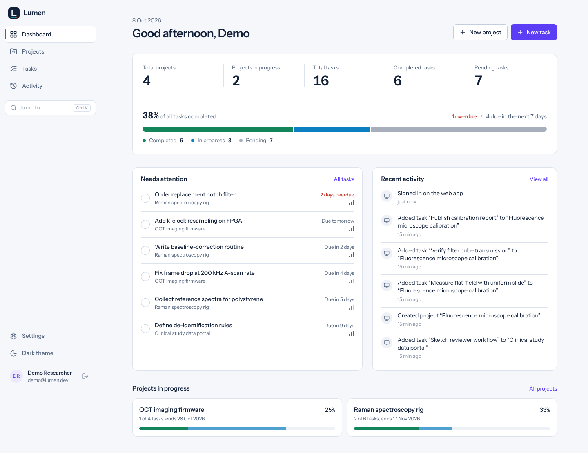
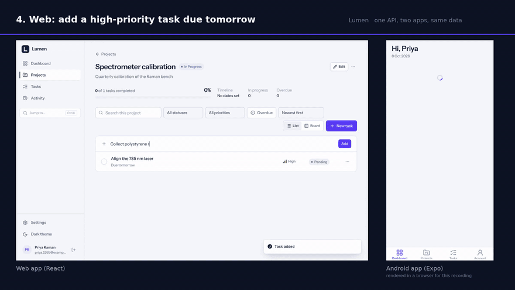
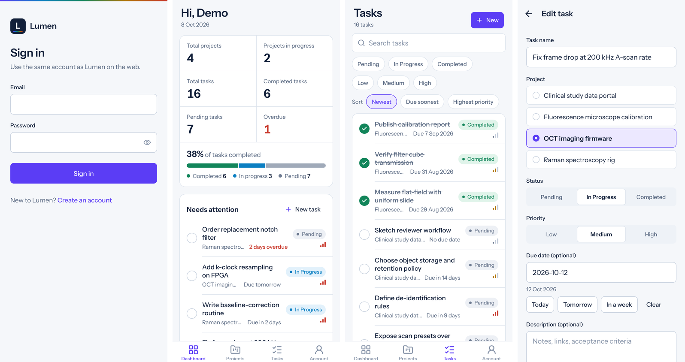
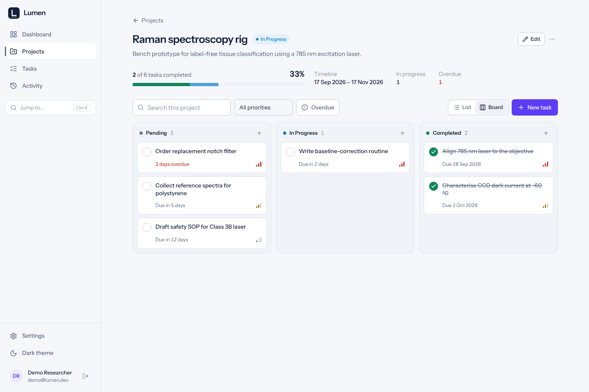
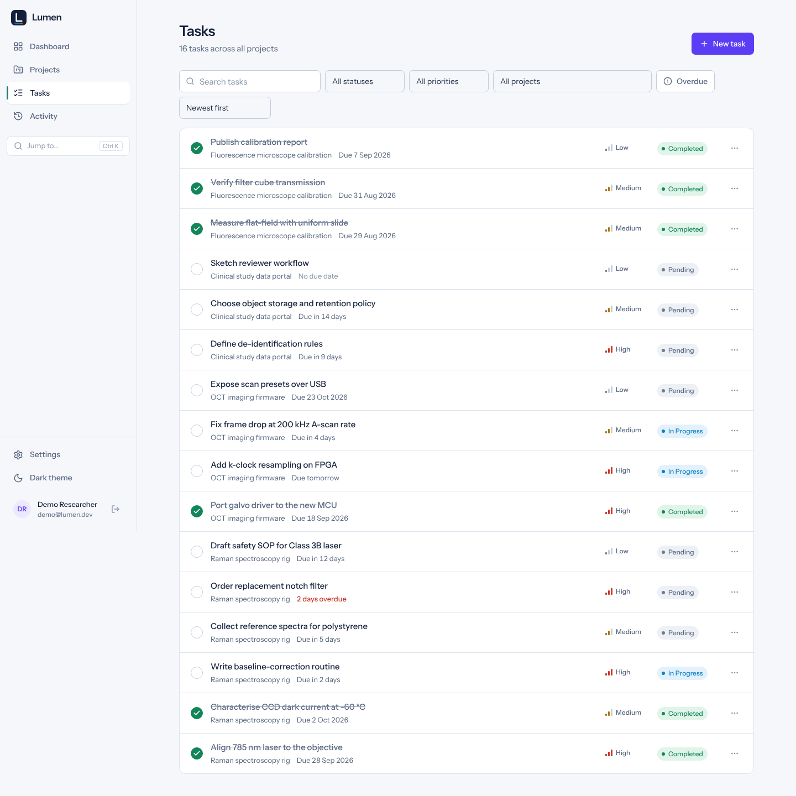
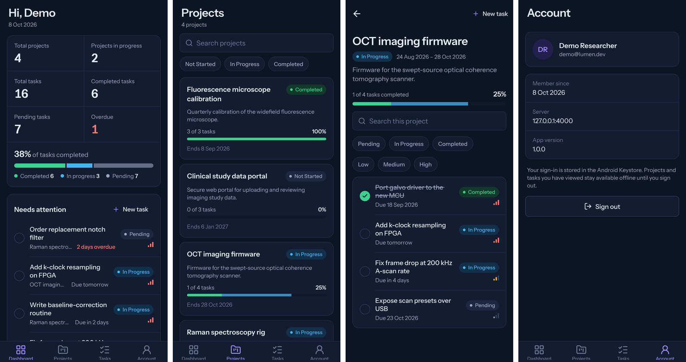
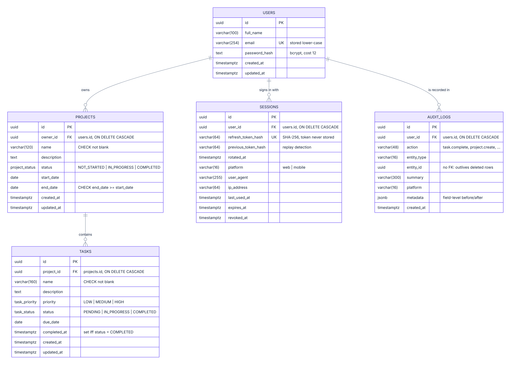

# Lumen

**Plan projects and track tasks on the web and on Android, from one secure API.**

[](https://github.com/RaktimChandra/lumen/actions/workflows/ci.yml)
[](https://github.com/RaktimChandra/lumen/actions/workflows/android.yml)
[](https://github.com/RaktimChandra/lumen/actions/workflows/codeql.yml)

Built for the ISMO Bio-Photonics Full Stack Developer assessment by **Raktim Chandra**. The name and the colour system come from the subject: every status colour is a laser line (405 nm violet, 488 nm blue, 532 nm green, 589 nm amber, 635 nm red).

| | |
|---|---|
| Web app | **https://lumen-api-x4be.onrender.com** |
| API | **https://lumen-api-x4be.onrender.com** · health: [`/api/health`](https://lumen-api-x4be.onrender.com/api/health) |
| API docs (Swagger UI) | **https://lumen-api-x4be.onrender.com/api/docs** |
| Android APK | **https://github.com/RaktimChandra/lumen/releases/download/v1.0.0/lumen-v1.0.0.apk** |
| Demo account | `demo@lumen.dev` / `LumenDemo2026` (or register your own) |

> The web app and the API are one Render service: the web app is at the root URL and the API under `/api`. It runs on Render's free tier, which sleeps when idle. The first request after a pause can take up to a minute; the web app shows a "starting the server" message while it wakes.



**Same account, same data:** tasks created on the web appear on the phone; a task completed and another added on the phone show up on the web, labelled by device.



Full automated walkthrough (68 s): [`docs/media/lumen-walkthrough.mp4`](docs/media/lumen-walkthrough.mp4). It drives both apps against one API; the Android UI is rendered in a browser for that recording. A recording on a real phone is described in the [demo script](docs/DEMO_SCRIPT.md).



---

## Contents

1. [What it does](#what-it-does)
2. [Requirements checklist](#requirements-checklist)
3. [Tech stack](#tech-stack)
4. [Run it locally](#run-it-locally)
5. [Environment variables](#environment-variables)
6. [Database](#database)
7. [API](#api)
8. [Mobile app](#mobile-app)
9. [Testing](#testing)
10. [CI/CD and deployment](#cicd-and-deployment)
11. [Security](#security)
12. [Design decisions](#design-decisions)
13. [Known limitations](#known-limitations)

More detail lives in [`docs/`](docs): [API reference](docs/API.md) · [Security](docs/SECURITY.md) · [Architecture and decisions](docs/ARCHITECTURE.md) · [Demo script](docs/DEMO_SCRIPT.md) · [ER diagram](docs/images/er-diagram.png) · [OpenAPI JSON](docs/openapi.json)

---

## What it does

- **Accounts** that work on both platforms: register on the web, sign in on the phone, or the other way round.
- **Projects** with status, dates and description, plus a live progress bar from their tasks.
- **Tasks** inside projects with priority, status, due date and description. Complete them with one tap, change status and priority, move them between projects.
- **Dashboard** with the five required counters (total projects, total tasks, completed tasks, pending tasks, projects in progress), a status breakdown, overdue and due-this-week counts, the tasks that need attention, and recent activity labelled by device.
- **Search and filters** on both platforms: projects by name and status; tasks by name, status, priority, project and overdue, with sorting and pagination.
- **Android app** with secure token storage, pull-to-refresh, offline viewing of saved data, a clear offline banner and a clear "session expired" sign-in screen.

Extras beyond the brief:

| Extra | Where |
|---|---|
| Board view with keyboard-accessible drag and drop between status columns | Web › project page › Board |
| `Ctrl/⌘ K` command palette to jump to any project or task | Web |
| Audit log of every change with its device (web or Android) | `GET /api/activity`, web Activity page, dashboards |
| Signed-in devices list with remote sign-out | Web › Settings |
| Rotating refresh tokens with replay detection | API |
| Offline viewing of projects and tasks | Android |
| Local reminders for tasks due tomorrow | Android |
| Light and dark themes | Web and Android |
| Shared validation, types and API client across all three apps | `packages/shared` |

<p>
  
  
</p>



---

## Requirements checklist

| Brief | Status | Notes |
|---|---|---|
| Register, login, logout; full name, email, password | ✅ | `POST /api/auth/register · login · logout`, `GET /api/auth/me` |
| Unique email; passwords never in plain text | ✅ | Unique index on lower-cased email; bcrypt cost 12 |
| Stay logged in until logout or expiry | ✅ | 15-min access token, refreshed silently with a 30-day rotating refresh token |
| One account on web and mobile | ✅ | Same API, same tables |
| Project CRUD, list own projects; all fields | ✅ | Name, description, status, start/end date, created date |
| Task CRUD, mark completed, list per project; all fields | ✅ | Name, description, priority, status, due date, created date (+ `completedAt`) |
| Dashboard counters for the signed-in user | ✅ | One aggregate SQL query, owner-scoped |
| Search projects/tasks by name; filter projects by status, tasks by status and priority | ✅ | Web and mobile |
| Mobile: register/login/logout, dashboard, projects, tasks, task CRUD, complete, status/priority, search/filter | ✅ | Expo / React Native |
| Android required | ✅ | APK built by GitHub Actions |
| Change on one platform shows on the other after refresh | ✅ | Pull-to-refresh on mobile; web also refreshes on focus and every 15 s |
| Token in secure storage (Keystore) | ✅ | `expo-secure-store` |
| Expired login → login screen with a clear message | ✅ | "Your session expired. Please sign in again." |
| No network → clear message, no crash or blank screen | ✅ | Offline banner, saved data, friendly error states |
| React or Next.js web; responsive; components; validation; loading; errors | ✅ | React 19 + Vite |
| React Native (Expo) or Flutter | ✅ | Expo SDK 57 |
| Node + Express or NestJS; REST; routes; middleware; errors; logging; CORS | ✅ | Express 5, pino request logs, CORS allow-list |
| PostgreSQL or MySQL; relational, FKs, normalised | ✅ | PostgreSQL 16, 3NF, FKs with cascade, CHECK constraints |
| bcrypt, JWT, auth middleware, protected routes | ✅ | |
| Users access only their own data | ✅ | 404 for others' data; proven in `security.test.ts` |
| Validate all input | ✅ | Shared zod schemas, strict objects |
| No sensitive data in responses | ✅ | Explicit response mappers; tested |
| SQL injection protection | ✅ | ORM + bound parameters; LIKE wildcards escaped |
| Rate limiting on auth | ✅ | Per IP and per email |
| All 15 required endpoints | ✅ | Plus refresh, sessions, activity, health, docs |
| Setup, env, database, API docs, mobile-against-deployed-backend docs | ✅ | This README + [`docs/API.md`](docs/API.md) |
| Public repo, ER diagram, API docs, README, URLs, APK, recording | ✅ | Recording: see [demo script](docs/DEMO_SCRIPT.md) |
| **Bonus:** Docker, unit tests, integration tests, pagination, sorting, audit logs, CI/CD, refresh tokens, due-tomorrow notifications, offline viewing, shared types/validation | ✅ | RBAC was not added: every user owns only their own data, so roles would be unused code |

---

## Tech stack

| Layer | Choice | Why |
|---|---|---|
| Backend | Node.js 22, **Express 5**, TypeScript | Explicit request path; native async errors |
| Database | **PostgreSQL 16**, **Drizzle ORM** | Typed SQL, committed SQL migrations, no binary engine |
| Validation | **zod 4** in `packages/shared` | One rule set for API, web and mobile; drives OpenAPI |
| Auth | bcryptjs, jsonwebtoken (HS256), opaque refresh tokens | See [security](docs/SECURITY.md) |
| Web | **React 19**, Vite, React Router 7, TanStack Query 5, Tailwind CSS 4, react-hook-form, dnd-kit | |
| Mobile | **Expo SDK 57**, React Native 0.86, Expo Router, TanStack Query (persisted), expo-secure-store, NetInfo | |
| Tests | Vitest + Supertest (real PostgreSQL), Testing Library, Jest (jest-expo) | 169 tests |
| Ops | GitHub Actions, CodeQL, Dependabot, Docker, docker compose, nginx, Render | |

---

## Run it locally

### Option A: Docker (one command)

Requires Docker.

```bash
git clone https://github.com/RaktimChandra/lumen.git
cd lumen
docker compose up --build
```

- Web app: http://localhost:8080
- API docs: http://localhost:4000/api/docs

Migrations run automatically when the API container starts. To load the demo data: `docker compose exec api node dist/seed.js`.

### Option B: Node.js

Requires **Node.js 20.19+ (22 recommended)** and **PostgreSQL 14+**.

```bash
git clone https://github.com/RaktimChandra/lumen.git
cd lumen
npm install
npm run build:shared            # the apps import the compiled shared package
```

**1. Database**

```bash
# psql as a superuser
CREATE USER lumen WITH PASSWORD 'lumen' CREATEDB;
CREATE DATABASE lumen OWNER lumen;
CREATE DATABASE lumen_test OWNER lumen;   -- only needed for the API tests
```

The first migration enables the `pg_trgm` extension (used for fast name search). Managed PostgreSQL services (Render, Supabase, Neon, RDS) allow it; on a self-hosted server the migration needs a role allowed to create extensions, or run `CREATE EXTENSION pg_trgm;` once as a superuser.

**2. API** (http://localhost:4000)

```bash
cp apps/api/.env.example apps/api/.env      # edit JWT_ACCESS_SECRET and DATABASE_URL if needed
npm run db:migrate
npm run db:seed                             # optional: demo@lumen.dev / LumenDemo2026
npm run dev:api
```

**3. Web** (http://localhost:5173, proxies `/api` to the API)

```bash
npm run dev:web
```

**4. Mobile**: see [Mobile app](#mobile-app).

---

## Environment variables

### API (`apps/api/.env`)

| Variable | Default | Description |
|---|---|---|
| `DATABASE_URL` | — (required) | PostgreSQL connection string |
| `JWT_ACCESS_SECRET` | — (required, ≥ 32 chars) | HMAC secret for access tokens. Generate: `node -e "console.log(require('crypto').randomBytes(48).toString('base64url'))"` |
| `NODE_ENV` | `development` | `production` enables secure cookies and JSON logs |
| `PORT` | `4000` | |
| `DATABASE_SSL` | `auto` | `true`, `false`, or `auto` (TLS unless the host is local) |
| `DATABASE_POOL_MAX` | `10` | |
| `ACCESS_TOKEN_TTL_SECONDS` | `900` | Access token lifetime |
| `REFRESH_TOKEN_TTL_DAYS` | `30` | Refresh token lifetime (sliding) |
| `BCRYPT_ROUNDS` | `12` | |
| `CORS_ORIGINS` | `http://localhost:5173` | Comma-separated web origins |
| `COOKIE_SAMESITE` | `strict` | `strict`, `lax` or `none` (needs HTTPS) |
| `TRUST_PROXY` | `1` | Proxy hops in front of the API (Render = 1) |
| `AUTH_RATE_LIMIT_MAX` / `AUTH_RATE_LIMIT_WINDOW_MINUTES` | `10` / `15` | Login + register per IP |
| `LOGIN_FAILURES_PER_EMAIL` | `5` | Failed logins per email per window |
| `API_RATE_LIMIT_PER_MINUTE` | `300` | Everything else, per IP |
| `LOG_LEVEL` | `info` | |

### Web (`apps/web`)

| Variable | Default | Description |
|---|---|---|
| `VITE_API_URL` | empty (same origin) | Leave empty: in production the API serves the web app, and the dev server proxies `/api`. Set only to call an API on another origin. |
| `VITE_DEV_API` | `http://localhost:4000` | Dev-server proxy target |

### Mobile (`apps/mobile/.env`)

| Variable | Default | Description |
|---|---|---|
| `EXPO_PUBLIC_API_URL` | `https://lumen-api-x4be.onrender.com` | API the app talks to, baked in at build time |

---

## Database



- `users` 1—* `projects` 1—* `tasks`; `users` 1—* `sessions`; `users` 1—* `audit_logs`.
- Third normal form: tasks do not repeat the owner; it is derived from the project.
- Integrity in the database itself: foreign keys with `ON DELETE CASCADE`, enums for status and priority, `CHECK (end_date >= start_date)`, non-blank names, `completed_at` set exactly when a task is completed, unique email.
- Indexes for every list query (`owner_id + status`, `project_id + status/priority/due_date`) and trigram GIN indexes for name search.
- Migrations are plain SQL in [`apps/api/drizzle`](apps/api/drizzle), generated from [`apps/api/src/db/schema.ts`](apps/api/src/db/schema.ts) and applied on every deploy (`npm run db:migrate`, idempotent).

Diagram sources: [`docs/er-diagram.mmd`](docs/er-diagram.mmd) (Mermaid), [SVG](docs/images/er-diagram.svg).

---

## API

Full reference with request/response examples: **[docs/API.md](docs/API.md)**. Interactive: **https://lumen-api-x4be.onrender.com/api/docs**.

| Method | Path | Auth | Purpose |
|---|---|---|---|
| POST | `/api/auth/register` | — | Create account, sign in |
| POST | `/api/auth/login` | — | Sign in |
| POST | `/api/auth/logout` | token or refresh | Revoke this session |
| GET | `/api/auth/me` | ✓ | Current user |
| POST | `/api/auth/refresh` | refresh | New access token (rotates refresh token) |
| GET / DELETE | `/api/auth/sessions[/{id}]` | ✓ | Signed-in devices |
| GET | `/api/projects` | ✓ | List (search, status, sort, page) |
| GET | `/api/projects/{id}` | ✓ | Read |
| POST | `/api/projects` | ✓ | Create |
| PUT | `/api/projects/{id}` | ✓ | Update (partial) |
| DELETE | `/api/projects/{id}` | ✓ | Delete with its tasks |
| GET | `/api/tasks` | ✓ | List (projectId, search, status, priority, overdue, sort, page) |
| GET | `/api/tasks/{id}` | ✓ | Read |
| POST | `/api/tasks` | ✓ | Create |
| PUT | `/api/tasks/{id}` | ✓ | Update, complete, move |
| DELETE | `/api/tasks/{id}` | ✓ | Delete |
| GET | `/api/dashboard` | ✓ | Counters for the signed-in user |
| GET | `/api/activity` | ✓ | Audit trail |
| GET | `/api/health` | — | Liveness + database check |

Errors always look like `{ "error": { "code", "message", "details"?, "requestId" } }`.

---

## Mobile app

### Install the APK

1. Download **https://github.com/RaktimChandra/lumen/releases/download/v1.0.0/lumen-v1.0.0.apk** on an Android phone.
2. Allow installing from your browser or file manager when Android asks.
3. Open Lumen and sign in with the same account you use on the web.

The APK is built by the [Android APK workflow](.github/workflows/android.yml) and points at the deployed API.

### Run the app from source against the deployed backend

```bash
cd apps/mobile
echo "EXPO_PUBLIC_API_URL=https://lumen-api-x4be.onrender.com" > .env
npx expo start
```

Then press `a` for an Android emulator, or scan the QR code with a development build. (Expo Go only supports its own SDK version; if your Expo Go is older than SDK 57, use an emulator or the APK.)

### Run it against a local API

- Android emulator: `EXPO_PUBLIC_API_URL=http://10.0.2.2:4000`
- Physical phone on the same Wi-Fi: `EXPO_PUBLIC_API_URL=http://<your-computer-LAN-IP>:4000`

`http://` URLs automatically allow cleartext traffic in that build only.

### Build the APK yourself

- **GitHub Actions (no account needed):** Actions → *Android APK* → *Run workflow* (optionally set `api_url`). The APK is attached to the run; tagging `v*` also publishes it to a GitHub Release.
- **Locally:** with Android Studio/SDK and JDK 17: `cd apps/mobile && npx expo prebuild --platform android && cd android && ./gradlew assembleRelease`.
- **EAS:** `npx eas build -p android --profile preview` (profile in `eas.json`).

---

## Testing

| Suite | Tool | Tests | Covers |
|---|---|---|---|
| API | Vitest + Supertest against **real PostgreSQL** | 106 | Auth, token expiry and refresh rotation, replay detection, logout, sessions, rate limits, validation, cross-user isolation, injection, response hygiene, CORS, headers, dashboard maths, activity |
| Shared | Vitest | 45 | Every schema edge case; API client refresh, session-end and error mapping |
| Web | Vitest + Testing Library | 11 | Forms, validation, server field errors, session-expired message, components |
| Mobile | Jest (jest-expo) | 7 | Keystore storage, launch flow, expiry → sign-in, offline start |

```bash
npm run build:shared
npm test                       # all workspaces (API tests need PostgreSQL; set TEST_DATABASE_URL)
npm run test:coverage -w @lumen/api
npm run lint && npm run typecheck && npm run format:check
```

API statement coverage is about 89%.

---

## CI/CD and deployment

| Workflow | Runs | Does |
|---|---|---|
| [CI](.github/workflows/ci.yml) | every push and PR | lint, Prettier check, type-check, API tests on a PostgreSQL service container with coverage, shared/web/mobile tests, production builds, Android JS bundle, Docker image builds |
| [Android APK](.github/workflows/android.yml) | changes to mobile/shared, tags, manual | `expo prebuild` + Gradle release build, uploads the APK, attaches it to tagged releases |
| [CodeQL](.github/workflows/codeql.yml) | push, PR, weekly | security-extended static analysis |
| [Keep-alive](.github/workflows/keepalive.yml) | every 10 min | keeps the free-tier API awake for reviewers |
| [Production smoke test](.github/workflows/smoke.yml) | daily, manual | [`scripts/smoke-test.mjs`](scripts/smoke-test.mjs): 35+ end-to-end checks against the live deployment (auth, cookies, CRUD, filters, dashboard, cross-user isolation, refresh rotation, logout revocation, web shell, CSP) |
| Dependabot | weekly | npm and Actions updates (Expo-managed packages excluded) |

**Hosting**

| Part | Where | How |
|---|---|---|
| PostgreSQL 16 | Render (Singapore) | managed database |
| API | Render web service (Singapore) | builds from `main`, runs migrations, then starts; health check `/api/health`. Blueprint: [`render.yaml`](render.yaml) |
| Web | Same Render service | the API serves the built web app from its own origin ([`apps/api/src/web.ts`](apps/api/src/web.ts)): first-party cookies, no CORS, strict hash-based CSP. [`apps/web/vercel.json`](apps/web/vercel.json) is kept for an optional separate Vercel deploy |
| APK | GitHub Actions artifacts / Releases | |

---

## Security

Summary (details, code references and the tests that prove each point: **[docs/SECURITY.md](docs/SECURITY.md)**):

- bcrypt (cost 12); constant-work login; same error for unknown email and wrong password.
- 15-minute JWT (HS256, issuer/audience checked) + server-side sessions, so logout is immediate.
- Rotating refresh tokens stored only as SHA-256; replaying an old one signs that session out.
- Web: access token in memory only; refresh token in an `HttpOnly; Secure; SameSite=Strict` cookie scoped to `/api/auth`. Mobile: Android Keystore.
- Owner-scoped queries everywhere; other users' data returns 404.
- Strict zod validation (unknown fields rejected), database CHECK constraints, ORM-parameterised SQL.
- Rate limits per IP and per account; helmet headers; CORS allow-list; strict CSP on the web app; secrets redacted from logs; request ids on every error.

---

## Design decisions

The reasoning behind each choice, with its cost, is in **[docs/ARCHITECTURE.md](docs/ARCHITECTURE.md)**. In short:

1. One shared package for validation, types and the API client.
2. Express 5 + Drizzle for an explicit, typed request path and committed SQL migrations.
3. A normalised schema where task ownership is derived from the project, with integrity enforced in PostgreSQL.
4. Short-lived JWT plus server-side sessions with rotating refresh tokens.
5. The web app and API share one origin (the API serves the built web app), so the refresh cookie is first-party.
6. Offline-first reads and fail-fast writes on mobile.
7. "Overdue" computed in the user's own time zone.
8. APK built reproducibly in GitHub Actions.

---

## Known limitations

- Free hosting: Render's free PostgreSQL expires 30 days after creation and the API sleeps when idle.
- Offline edits on the phone are not queued; the app explains that changes need a connection.
- No email verification, password reset or roles; the session model is ready for them.
- Projects are created and edited on the web; the mobile app views projects and fully manages tasks, as the brief specifies.

---

## Licence

MIT © 2026 Raktim Chandra. AI-assisted tools were used during development, as the assessment allows.
