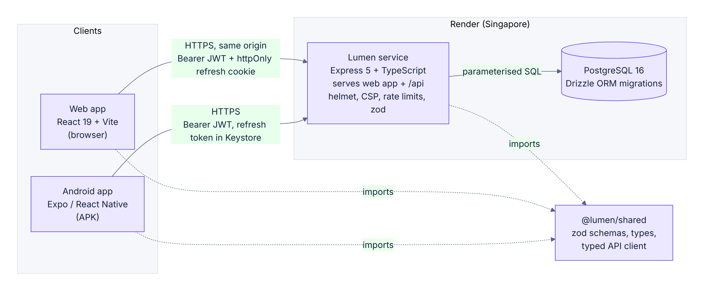
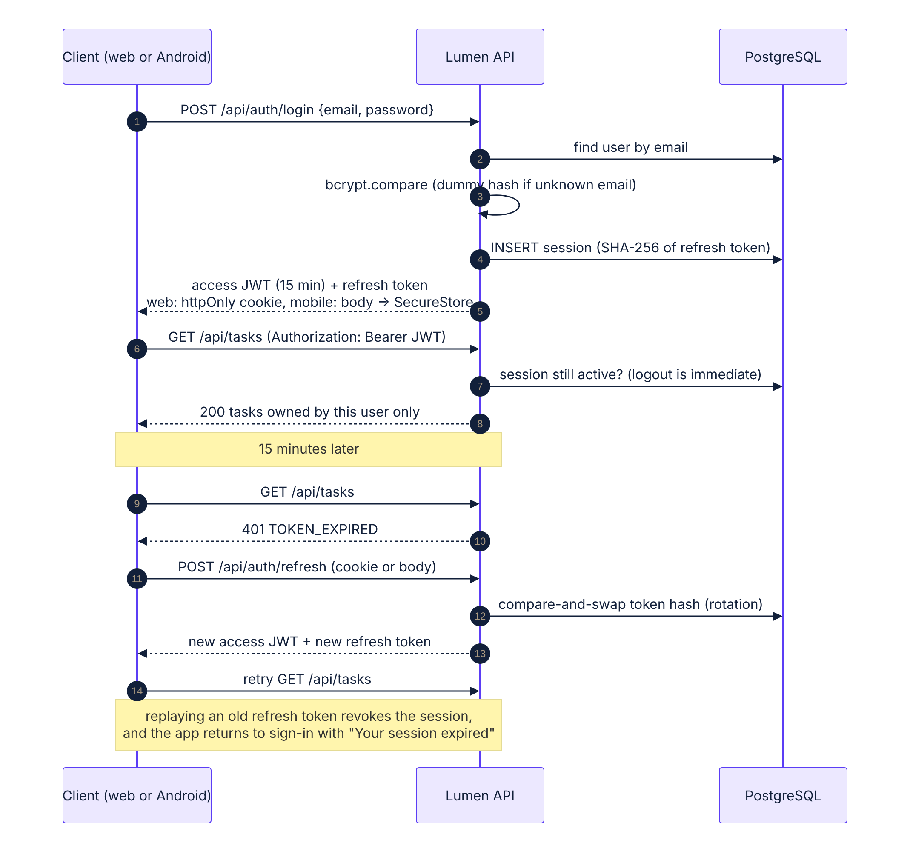

# Architecture and design decisions



## Shape of the system

Lumen is an npm-workspaces monorepo with four packages:

| Package | Role |
|---|---|
| `packages/shared` | Domain enums, field limits, zod validation schemas, response types and a typed `fetch` client with token refresh. Built to ESM + CJS + `.d.ts` with tsup. |
| `apps/api` | The only backend. Express 5, TypeScript, Drizzle ORM, PostgreSQL. |
| `apps/web` | React 19 + Vite + Tailwind CSS 4 + TanStack Query. In production the built app is served by the API service. |
| `apps/mobile` | Expo SDK 57 (React Native 0.86, new architecture) with Expo Router, built to an Android APK. |

The web and mobile apps call exactly the same endpoints with exactly the same client code. A change made on one platform is a row in the same PostgreSQL table the other platform reads.

## Decisions

Each decision lists what was chosen, why, and what it costs. These are the points I expect to discuss in the review.

### 1. One shared package for validation, types and the API client

- **Chosen:** zod schemas live in `packages/shared` and are imported by the API (request validation), the web forms and the mobile forms (via `react-hook-form` + `zodResolver`). The OpenAPI document is generated from the same schemas.
- **Why:** a rule such as "end date cannot be before start date" or "password needs a letter and a number" is written once. The client shows the same message the server would return, before a request is made. The docs cannot drift.
- **Cost:** the shared package must be built before the apps (`npm run build:shared`); CI and the deploy scripts do this.

### 2. Express 5 + Drizzle instead of NestJS + Prisma

- **Chosen:** Express 5 (native async error propagation) with small route/service modules per resource, and Drizzle ORM.
- **Why:** the brief allows either framework. Express keeps the request path explicit for review. Drizzle is SQL-shaped, fully typed, has no binary query engine, generates plain SQL migrations that are committed (`apps/api/drizzle`), and still parameterises every value.
- **Cost:** no dependency-injection container; dependencies are passed explicitly through an `AppContext`, which also makes the app easy to construct in tests (`createApp({ config, db, logger })`).

### 3. Normalised schema, ownership derived through the project

- **Chosen:** `tasks` has no `owner_id`. Ownership is `tasks.project_id → projects.owner_id`. Every task query joins or sub-selects on projects owned by the caller.
- **Why:** third normal form; ownership cannot drift if a task is moved between projects.
- **Cost:** task queries always include a join. Composite indexes (`project_id, status`), (`project_id, priority`), (`project_id, due_date`) and (`owner_id, …`) on projects keep these cheap.

### 4. Database-level integrity, not just application checks

`CHECK (end_date >= start_date)`, `CHECK (length(btrim(name)) > 0)`, `CHECK ((status = 'COMPLETED') = (completed_at IS NOT NULL))`, foreign keys with `ON DELETE CASCADE`, a unique email, and PostgreSQL enums for status and priority (declared low→high so `ORDER BY priority` sorts by urgency). Violations that slip past validation become clean 400/409 responses.

### 5. Short-lived JWT plus server-side sessions with rotating refresh tokens

- **Chosen:** 15-minute HS256 access token carrying a session id; 30-day opaque refresh token, stored only as a SHA-256 hash and rotated on every use, with replay detection.
- **Why:** pure stateless JWT makes "logout" a client-side illusion. Checking the session row on each request (one primary-key lookup) makes logout and "sign out this device" immediate, and lets the web Settings page show every signed-in device across web and Android.
- **Cost:** one extra indexed query per request.

### 6. Web: one origin for the page and the API

- **Chosen:** the API serves the built web app (`apps/api/src/web.ts`), so the browser calls `/api/*` on the page's own origin. Development uses the Vite proxy and Docker uses nginx the same way. A Vercel config (`apps/web/vercel.json`, rewriting `/api/*` to the API) is included for hosting the web app separately.
- **Why:** the refresh cookie is first-party, so `SameSite=Strict` works and third-party-cookie blocking in Safari/Chrome is not an issue; the strict CSP can use `connect-src 'self'`.
- **Cost:** web and API scale together as one service, which is the right trade at this size.

### 7. Mobile: offline-first reads, fail-fast writes

- **Chosen:** TanStack Query with `networkMode: 'offlineFirst'`, persisted to AsyncStorage (projects, tasks and dashboard only). NetInfo drives React Query's online state and a visible banner. Mutations use `networkMode: 'always'` so they fail immediately offline with a clear message instead of hanging.
- **Why:** the brief requires "no network → clear message, not a crash or blank screen". Showing the last data you saw, with a banner, satisfies that and adds the "offline viewing" bonus.
- **Cost:** queued offline edits are deliberately out of scope; conflict resolution would need a sync design of its own.

### 8. Overdue is computed in the user's time zone

The server cannot know the user's calendar day. Both clients send `today=YYYY-MM-DD` on list and dashboard requests; the API falls back to the UTC date. A task due today in Chennai is not "overdue" at 1 a.m. IST just because the server runs on UTC.

### 9. Lightweight live updates

Lists and the dashboard refetch on window focus, on app foreground, on pull-to-refresh, and every 15 seconds while a web tab is visible. A task created on the phone appears on an open web dashboard within seconds without a reload. WebSockets were considered and rejected for this scope: they add a stateful connection to a free-tier server that sleeps.

### 10. APK built in GitHub Actions

`expo prebuild` + Gradle `assembleRelease` on GitHub's Ubuntu runners produces the APK and attaches it to tagged releases. No Expo account or build queue is needed, and anyone can rebuild it from the repository. `eas.json` is included for teams that prefer EAS.

## Request lifecycle



1. `pino-http` assigns a request id (or accepts a well-formed `X-Request-Id`) and logs the request with secrets redacted.
2. `helmet`, CORS allow-list, compression, a 100 KB JSON body parser and cookie parsing.
3. Per-route rate limiters.
4. `authenticate`: verify JWT → check the session is active → set `req.auth`.
5. The route parses params, query and body with the shared zod schema.
6. The service runs owner-scoped queries, wrapping each mutation and its audit-log entry in one transaction.
7. The response is built by an explicit mapper (no row spreading).
8. Any thrown error reaches one error handler that maps zod, body-parser and PostgreSQL errors to the standard error shape.

## Repository layout

```
.
├── apps
│   ├── api            Express API (src/modules/{auth,projects,tasks,dashboard,activity,health})
│   │   ├── drizzle    SQL migrations (committed)
│   │   └── test       Vitest + Supertest integration tests on PostgreSQL
│   ├── web            React app (src/features/*, src/components/ui/*)
│   └── mobile         Expo app (app/ = routes, src/ = auth, api, features, components)
├── packages/shared    zod schemas, types, API client, formatting helpers
├── docs               API reference, security, diagrams, screenshots, demo script
├── .github/workflows  CI, Android APK, CodeQL, keep-alive
├── docker-compose.yml PostgreSQL + API + web (nginx)
└── render.yaml        Render blueprint
```
